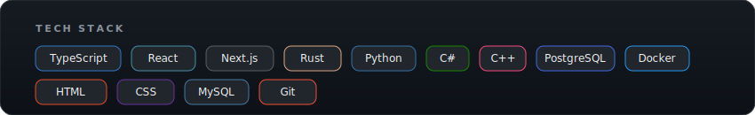

  

   

  
  &nbsp;&nbsp;
  

    

  

  <table>
    <tr>
      <td align="center">
        
      </td>
      <td align="center">
        
      </td>
    </tr>
  </table>

   

  

    

  

  

    

  

  

