  <h3>Full-stack Developer</h3>
  <h1>Pavel</h1>

  

    I build clean interfaces, solid backends, and software 
    that works well out of the box — from web apps to systems code.
  

   

  
  &nbsp;
  

    

  
  &nbsp;
  
  &nbsp;
  
  &nbsp;
  

 

---

<h3 align="center">Languages</h3>

<!-- LANGUAGES:START -->

  
  
  
  
  
  
  
  
  

<!-- LANGUAGES:END -->

<!-- SCAN-INFO:START -->

  Curated from <code>config/languages.json</code> · add <code>GH_PAT</code> for private repo scan

<!-- SCAN-INFO:END -->

 

---

<h3 align="center">Stack</h3>

  
  
  
  
  
  
  
  

 

---

<h3 align="center">Featured</h3>

  
  &nbsp;
  

 

  
GitHub activity

   
  

    <table>
      <tr>
        <td align="center">
          
        </td>
        <td align="center">
          
        </td>
      </tr>
    </table>
     
    
  

